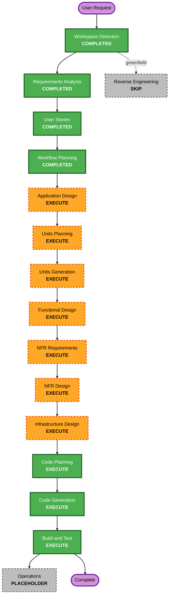

# Execution Plan

## Detailed Analysis Summary

### Transformation Scope (Greenfield)
- **Transformation Type**: New system build (greenfield)
- **Primary Changes**: Construcción de sistema end-to-end de workflow loop productivo sobre Telegram
- **Related Components**:
  - Telegram adapter
  - Capture/normalization module
  - Deterministic prioritization engine
  - Nudge orchestrator
  - Loop state store and event log
  - Reporting and rescue mode
  - Observability and security controls

### Change Impact Assessment
- **User-facing changes**: Yes - experiencia completa de captura/ejecución diaria en Telegram
- **Structural changes**: Yes - arquitectura orientada a estado y eventos
- **Data model changes**: Yes - estado materializado + eventos mínimos
- **API changes**: Yes - contratos internos entre módulos y endpoints/bot handlers
- **NFR impact**: Yes - seguridad baseline, confiabilidad de loop, auditabilidad, mantenibilidad

### Risk Assessment
- **Risk Level**: High
- **Rollback Complexity**: Moderate (greenfield; riesgo principal en diseño incorrecto del loop)
- **Testing Complexity**: Complex (flujo conversacional, estados, timing de nudges, idempotencia)

## Workflow Visualization

### Text Alternative
Phase 1: INCEPTION
- Workspace Detection: COMPLETED
- Reverse Engineering: SKIP (greenfield)
- Requirements Analysis: COMPLETED
- User Stories: COMPLETED
- Workflow Planning: COMPLETED
- Application Design: EXECUTE
- Units Planning: EXECUTE
- Units Generation: EXECUTE

Phase 2: CONSTRUCTION
- Functional Design: EXECUTE
- NFR Requirements: EXECUTE
- NFR Design: EXECUTE
- Infrastructure Design: EXECUTE
- Code Planning: EXECUTE
- Code Generation: EXECUTE
- Build and Test: EXECUTE

Phase 3: OPERATIONS
- Operations: PLACEHOLDER

## Phases to Execute

### 🔵 INCEPTION PHASE
- [x] Workspace Detection (COMPLETED)
- [x] Reverse Engineering (SKIPPED)
- [x] Requirements Analysis (COMPLETED)
- [x] User Stories (COMPLETED)
- [x] Workflow Planning (COMPLETED)
- [ ] Application Design - EXECUTE
  - **Rationale**: Se requieren componentes/servicios nuevos y fronteras claras entre módulos del loop.
- [ ] Units Planning - EXECUTE
  - **Rationale**: Necesitamos descomposición de historias en unidades de trabajo para construcción ordenada.
- [ ] Units Generation - EXECUTE
  - **Rationale**: Deben generarse artefactos de unidad y dependencias para guiar diseño por unidad.

### 🟢 CONSTRUCTION PHASE
- [ ] Functional Design - EXECUTE
  - **Rationale**: Lógica de negocio del loop y reglas determinísticas requieren diseño detallado.
- [ ] NFR Requirements - EXECUTE
  - **Rationale**: Seguridad baseline habilitada + confiabilidad/auditabilidad obligatorias.
- [ ] NFR Design - EXECUTE
  - **Rationale**: Se necesita traducir NFRs a patrones concretos de arquitectura/código.
- [ ] Infrastructure Design - EXECUTE
  - **Rationale**: MVP deployable requiere mapeo de componentes a infraestructura real.
- [ ] Code Planning - EXECUTE (ALWAYS)
  - **Rationale**: Necesario para secuencia de implementación con bajo riesgo.
- [ ] Code Generation - EXECUTE (ALWAYS)
  - **Rationale**: Implementación de módulos y contratos.
- [ ] Build and Test - EXECUTE (ALWAYS)
  - **Rationale**: Validación integral del loop y criterios de aceptación.

### 🟡 OPERATIONS PHASE
- [ ] Operations - PLACEHOLDER
  - **Rationale**: Fuera del alcance operativo actual del workflow.

## Estimated Timeline
- **Total Stages**: 11 (incluyendo etapas ya completadas)
- **Remaining Stages to Execute**: 10
- **Estimated Duration**: 2 a 3 semanas (dependiendo profundidad técnica y setup de despliegue)

## Success Criteria
- **Primary Goal**: MVP Telegram deployable que ejecute loop completo con estado persistente y rescue mode.
- **Key Deliverables**:
  - Arquitectura y unidades de trabajo definidas
  - Código funcional del loop end-to-end
  - Métricas base del ciclo instrumentadas
  - Controles de seguridad baseline aplicados donde corresponda
- **Quality Gates**:
  - Trazabilidad FR -> historias -> unidades -> implementación
  - Pruebas de flujo crítico `capture -> decide -> push -> respond -> learn`
  - Verificación de guardrails de seguridad y tono
