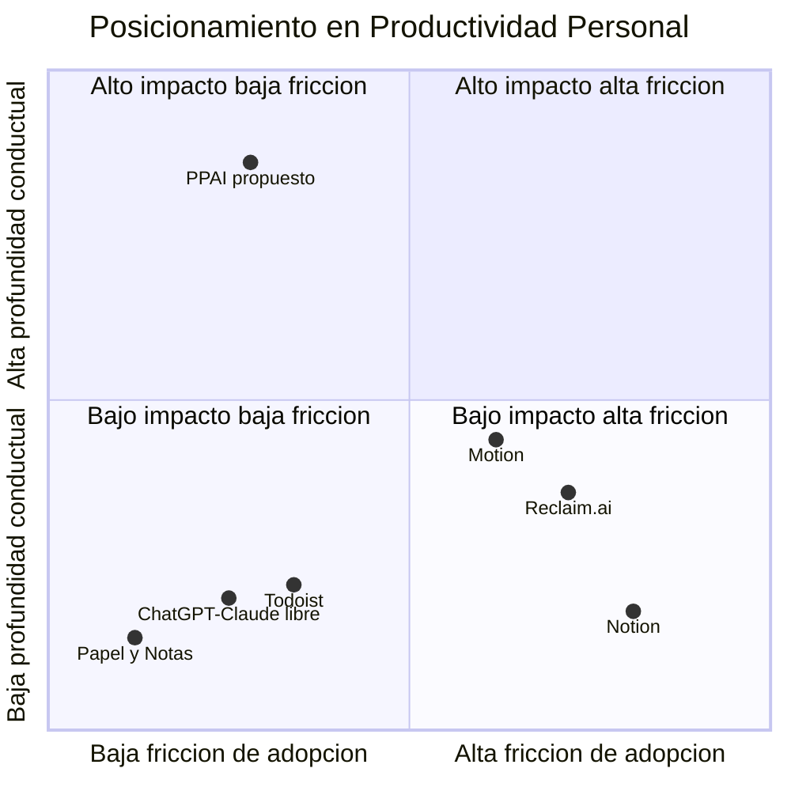
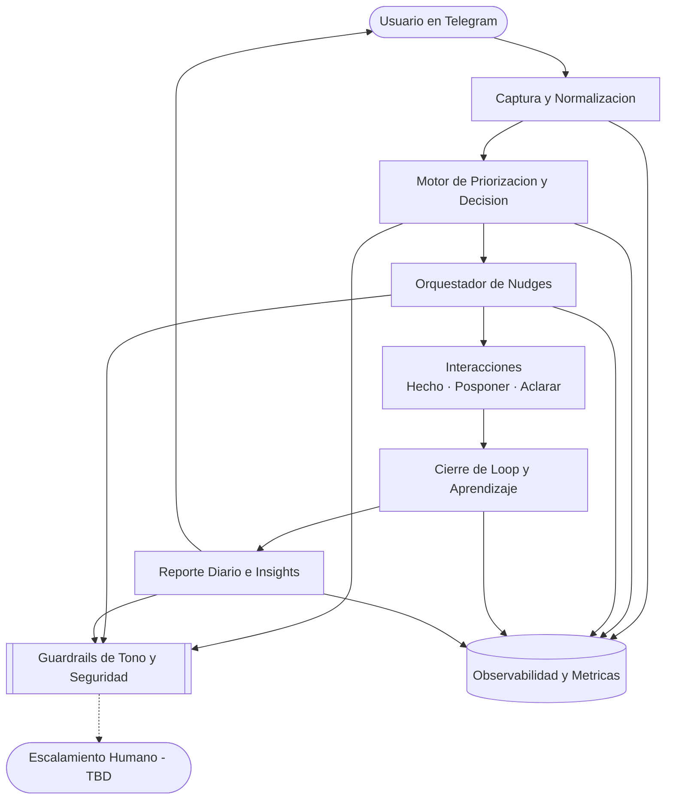

# PRD — PPAI (Personal Productivity AI)

Fecha: 2026-03-04
Estado: Consolidado (v1.0)

## Fuentes base

- `docs/00_contexto/00_resumen_idea.md`
- `docs/00_contexto/01_supuestos_y_riesgos.md`
- `docs/01_research/01_deep_research_pro.md`
- `docs/01_research/02_deep_research_con.md`
- `docs/01_research/05_sintesis_y_decision.md`
- `docs/03_producto/01_product_vision_board.md`
- `docs/02_usuarios/` (sin contenido)

## Paso 0 — Análisis de Conflictos

| # | Tipo de Conflicto | Doc A dice... | Doc B dice... | Decisión tomada |
|---|---|---|---|---|
| 1 | Método de ejecución | Construir MVP Telegram | Validar antes de construir | Validación de comportamiento primero y build en fases |
| 2 | Go/No-Go | GO provisional | CONDICIONAL / pivot de método | GO condicionado a umbrales de retención, calidad y costo |
| 3 | Moat | Data Behavioral Moat | “No hay moat” temprano | Moat por datos a mediano plazo; corto plazo = ejecución disciplinada |
| 4 | Canal | Telegram como canal natural | Telegram puede ser barrera | Telegram v1 con revisión periódica de sesgo de canal |
| 5 | Pricing | $9–15/mes (hipótesis) | $0–3/mes posible percepción | Precio TBD y validación por entrevistas post-demo |
| 6 | Alcance | 2 flujos en MVP | Empezar con 1 flujo | Flujo 1 obligatorio, flujo 2 condicionado por señales de uso |
| 7 | Retención | Objetivo D7 > 40% | Riesgo estructural categoría | D7 >= 40% meta; revisar/pivot si < 25–30% |
| 8 | Costos LLM | Hipótesis <= $0.50–$1 | Riesgo real $2–5 | Umbral operativo <= $1, alerta/pivot > $2 |
| 9 | Calendario | Fuera de MVP | Crítica por complejidad calendario | Confirmado fuera de v1 |
| 10 | Evidencia de usuario | Señales de escritorio | Faltan entrevistas/transcripciones | Research de usuarios obligatorio en siguiente ciclo |

## Segmento 1 — One-Liner + JTBD + Misión

### One-liner
PPAI es un agente de productividad personal que opera un workflow loop en Telegram: captura intención, prioriza la siguiente acción y cierra el ciclo con aprendizaje conductual. No es un generador de planes; es un sistema de ejecución continua con estado persistente.

### JTBD principal
Cuando tengo varias tareas y me bloqueo sin saber por dónde empezar, quiero capturarlas en lenguaje natural y recibir una prioridad accionable en el canal que ya uso, para convertir intención en ejecución real sin culpa ni sobrecarga.

### Misión
Ayudar a trabajadores autónomos a sostener ciclos diarios de ejecución, no solo listas de intención. Reducir la fricción entre “sé qué hacer” y “lo hice”, usando acompañamiento proactivo y aprendizaje de patrones reales. Construir un sistema confiable, no acusatorio, que mejore decisión y hábito con cada ciclo.

## Segmento 2 — Contexto y Problema

### Dolores del mercado
- La fricción principal es de ejecución, no de planificación.
- El abandono en productividad personal es un riesgo estructural de categoría.
- Si la clasificación IA falla, el producto añade fricción.
- El reporte nocturno puede crear valor o culpa según el tono.

### ¿Por qué ahora?
- Los LLMs reducen costo y tiempo de iteración de agentes conversacionales.
- Existe saturación de herramientas de planificación sin resolver ejecución sostenida.
- Telegram permite time-to-value rápido en v1.

### Alternativas actuales y limitaciones
- Todoist/Notion: registran, pero no conducen ejecución diaria.
- Motion/Reclaim: optimizan calendario, no necesariamente conducta de inicio.
- ChatGPT/Claude: generan plan, no operan estado diario persistente por defecto.
- Papel/notas/WhatsApp: capturan rápido, pero no cierran loop.

## Segmento 3 — ICP Detallado

### ICP Primario
- Freelancer/solopreneur técnico en LATAM.
- 25–38 aprox., autoempleado, mezcla trabajo de clientes y proyectos propios.
- Usa Telegram y ya probó herramientas de productividad sin consistencia sostenida.

### ICP Secundario
- Estudiante autodidacta intensivo (18–26), alta sensibilidad a precio.

### Buyer personas
- Usuario-pagador individual (decisión de compra para sí).
- Usuario-explorador (prueba y refiere, alto riesgo de churn).
- Expansión futura TBD (microequipos/mentores/creators).

### Pains
- “Sé qué hacer, pero no arranco”.
- Paralización por backlog largo.
- Captura sin conversión a ejecución.
- Culpa acumulada al cierre del día.

### Triggers de compra
- Lunes sin claridad.
- Días improductivos consecutivos.
- Riesgo de atraso con cliente.
- Abandono reciente de otra app.

### Objeciones probables y respuesta
- “Ya tengo Notion/Todoist”: PPAI cierra ejecución, no reemplaza necesariamente registro.
- “Lo voy a abandonar”: foco en valor en 24h + loop mínimo de 5 días.
- “Sin dashboard no hay valor”: el valor inicial está en acción diaria.
- “Privacidad”: minimización de datos y límites claros de alcance.

### Verbatims de documentos
- “No es un generador de planes — es un conductor de proceso.”
- “Sabe exactamente qué debería hacer y aun así no arranca.”
- “El sistema depende de una disciplina que promete reemplazar.”

### Recomendación futura (entrevistas + evolución ICP)
- Ejecutar ciclo trimestral de 8–12 entrevistas.
- Composición sugerida: 70% ICP primario, 30% near-ICP.
- Mantener matriz ICP viva con 3 señales: D7, % `/done`, WTP post-uso.
- Regla: si un subsegmento supera al ICP actual en 3 señales por 2 ciclos seguidos, promoverlo.

## Segmento 4 — UVP y Diferenciadores

### UVP
PPAI resuelve la brecha entre intención y ejecución diaria para freelancers/solopreneurs técnicos en LATAM, operando un loop conversacional en Telegram (captura → decide → ejecuta → confirma → aprende) con tono no acusatorio y aprendizaje de comportamiento real.

### Brecha de mercado
Capa de orquestación conductual diaria: transformar captura en acción priorizada y aprendizaje de cierre.

### Matriz 2x2

## Segmento 5 — Casos de Uso Top 5

| # | Caso | Actor | Trigger | Resultado esperado | KPI impactado |
|---|---|---|---|---|---|
| 1 | Arranque de día sin claridad | Usuario final | Inicio de jornada | Inicio rápido de ejecución | % con >=1 tarea en primera hora |
| 2 | Nudge en ventana óptima | Usuario final | Hora sugerida | Mayor cierre del loop | % `/done`, latencia nudge→acción |
| 3 | Tarea ambigua | Usuario final | `? Aclarar` | Menos bloqueo por ambigüedad | % tareas aclaradas que cierran |
| 4 | Posposición repetida | Usuario + motor | `⏸ Posponer` recurrente | Reactivación de tareas atascadas | Tasa reactivación post-snooze |
| 5 | Cierre diario | Usuario final | 21:00 | Insight + ajuste próximo ciclo | % útil, % culpa, % apertura |

### Caso de uso futuro recomendado
- Modo “Rescate de Día Caído” (sin `/done` antes de las 14:00): plan de recuperación de 1 tarea clave + 1 microtarea.

## Segmento 6 — Principios de Diseño No Negociables

| Principio | Significado operativo | Manifestación en interfaz | Prohibido |
|---|---|---|---|
| Proceso sobre output | El valor es cerrar el loop | Estados explícitos y CTAs | Entregar solo “plan” sin seguimiento |
| Tono no acusatorio | Curiosidad, no juicio | Mensajería empática y neutral | “fallaste”, “no cumpliste”, “otra vez” |
| Fricción mínima | Captura en 1 paso | Texto libre + botones inline | Setup largo obligatorio |
| Aprendizaje real | Aprender de comportamiento | Registro `/done` `/snooze` latencia | Personalización sin datos reales |
| Privacidad y límites | Minimizar datos y claims | Alcance claro en producto | Claims de terapia/salud |
| Disciplina de scope | Validar antes de expandir | Roadmap por fases | Scope creep fuera de MVP |

## Segmento 7 — User Journeys

### 1. Happy path usuario final
1. Captura tareas por Telegram.
2. Recibe Top 3 priorizadas.
3. Recibe nudge con botones.
4. Marca `✓ Hecho` o ajusta vía `⏸/?`.
5. Recibe reporte nocturno y siguiente ajuste.

### 2. Happy path operador/admin
1. Configura ventana de actividad y tono.
2. Monitorea métricas de loop.
3. Ajusta reglas de intensidad/prioridad.
4. Audita calidad de outputs y guardrails.

### 3. Edge case: interrupción/abandono
1. No respuesta al nudge.
2. Reenganche de baja intensidad.
3. Reanudación con tarea pequeña accionable.

### 4. Edge case: no resoluble por agente
1. Detección de fuera de alcance.
2. Transparencia de límites.
3. Clarificación o escalamiento humano (TBD operativo).

## Segmento 8 — MVP Scope (MoSCoW)

### Must Have
- Captura en lenguaje natural por Telegram.
- Clasificación y priorización Top 3.
- Nudges con botones inline.
- Registro de eventos del loop.
- Reporte diario en texto no acusatorio.
- Guardrails de tono y claims.
- Instrumentación de métricas críticas.

### Should Have
- Ventana de silencio configurable.
- Reenganche por inactividad.
- Detección simple de posposición repetida.
- Consola operativa mínima.

### Could Have
- Rescate de día caído.
- Personalización de estilo de nudge.
- CLI sincronizado (Fase 2).
- Resumen semanal.

### Won’t Have (por ahora)
- Google Calendar.
- Dashboard visual completo.
- App móvil/web propia.
- Modo equipo.
- Features de salud mental.
- Rutinas complejas tipo pomodoro avanzado.

## Segmento 9 — Especificación Funcional

### Módulos
1. Captura y normalización.
2. Motor de priorización y decisión.
3. Orquestador de nudges.
4. Cierre de loop y aprendizaje.
5. Reporte diario e insights.
6. Guardrails, seguridad y cumplimiento.
7. Observabilidad y métricas.

### Arquitectura funcional

## Segmento 10 — Métricas de Éxito

### North Star Metric
% de usuarios activos que completan >= 1 tarea/día durante 5 días consecutivos (D1–D5).

### KPIs clave
- Activación: capturas D1, tiempo a primer `/done`, ejecución en primera hora.
- Retención: D1, D7, usuarios activos Día 5.
- Calidad: % Top 3 completadas, % reporte útil, % culpa.
- Economía: costo LLM por usuario/mes.

### Metas operativas
- D1 >= 65%
- D7 >= 40%
- % reporte útil >= 60%
- % culpa <= 33%
- costo LLM <= $1 (alerta > $2)

### Métricas de calidad del agente
- Factualidad operativa >= 98%
- Adherencia a guardrails >= 99%
- Lenguaje acusatorio: 0%
- Claims prohibidos: 0%
- Escalamiento correcto >= 95%

## Segmento 11 — Plan de Evaluación del Agente

### Dataset inicial
- 300 capturas naturales.
- 120 eventos de seguimiento.
- 80 reportes diarios.
- 40 edge cases.
- 30 casos adversariales/red-team.

### QA de outputs
1. Validación automática de formato/guardrails.
2. Muestreo humano diario 10–20%.
3. Scorecard de exactitud, utilidad, tono, seguridad.
4. Registro de incidentes y corrección semanal.
5. Re-test de regresión antes de cambios.

### Red-teaming
- Prompt injection.
- Forzado de tono agresivo.
- Ambigüedad extrema.
- Datos sensibles.
- Inconsistencia de estado.
- Casos fuera de alcance.

## Segmento 12 — Riesgos y Mitigaciones

| # | Riesgo | Prob. | Impacto | Mitigación |
|---|---|---|---|---|
| 1 | Abandono temprano | Alta | Alto | MVP de papel + reenganche + gates D5/D7 |
| 2 | Baja captura sostenida | Media-Alta | Alto | Fricción mínima + apertura de día + monitoreo |
| 3 | Clasificación inexacta | Media | Alto | Benchmark previo + corrección 1 tap + fallback clarify |
| 4 | Reporte genera culpa | Media | Alto | Guardrails + encuesta emocional + rediseño si >33% |
| 5 | Fatiga de notificaciones | Media | Medio-Alto | Límite de nudges + silencio + intensidad adaptativa |
| 6 | Costo LLM no sostenible | Media | Alto | Fase 1: modelos pequeños + cache + prompts. Fase 2: evaluar destilación/fine-tuning con dataset real. Fase 3: arquitectura híbrida (modelo destilado para casos estándar + fallback general para casos complejos). Mantener observabilidad por evento y ajustar/pivot si >$2 usuario/mes. |
| 7 | Falta de moat temprano | Media | Medio-Alto | Priorizar retención y dataset propietario |
| 8 | Riesgo de privacidad | Media | Alto | Minimización de datos + política de retención/borrado (TBD legal) |
| 9 | Scope creep | Alta | Alto | Congelamiento MoSCoW + revisión semanal estricta |
| 10 | Dependencia de APIs externas | Media | Medio-Alto | Capa desacoplada de proveedor + fallback + monitoreo |

## Segmento 13 — Plan 30/60/90

### Días 1–30
- Prototipo funcional mínimo de Flujo 1.
- Instrumentación de eventos y validación de SC1/SC3.
- Cohorte inicial 3–5 usuarios y decisión go/pivot.

### Días 31–60
- MVP operable de loop completo v1.
- Piloto controlado 10–20 usuarios (TBD definitivo).
- Reglas anti-fatiga y control de tono en operación.

### Días 61–90
- Medición de NSM, D7/D30, calidad y costo.
- Iteración por evidencia: clasificación, tono, intensidad, pricing.
- Decisión: escalar, optimizar un ciclo más, o pivotar segmento/canal.

## Alertas de decisión (trade-offs clave)

> ⚠️ Build rápido vs validación previa: construir temprano acelera ingeniería pero aumenta riesgo de producto no adoptado.

> ⚠️ Telegram-only vs multicanal temprano: más foco y velocidad en v1, con riesgo de sesgo de canal.

> ⚠️ Reporte nocturno como diferenciador: puede mejorar retención o causar churn por culpa si el tono falla.

> ⚠️ Optimización de costo vs calidad de experiencia: reducir costo agresivamente puede degradar utilidad si no hay arquitectura híbrida.

## Campos TBD pendientes críticos

- Baselines reales de KPIs con usuarios (`docs/02_usuarios`).
- Política legal de privacidad/retención para piloto.
- Protocolo operativo de escalamiento humano (SLA/canal/roles).
- Pricing final y empaquetado (validación post-demo).
